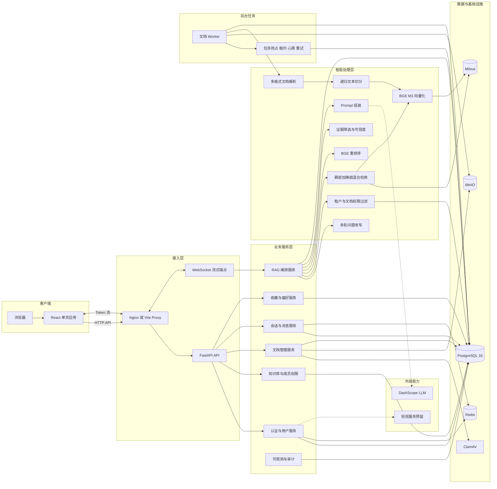
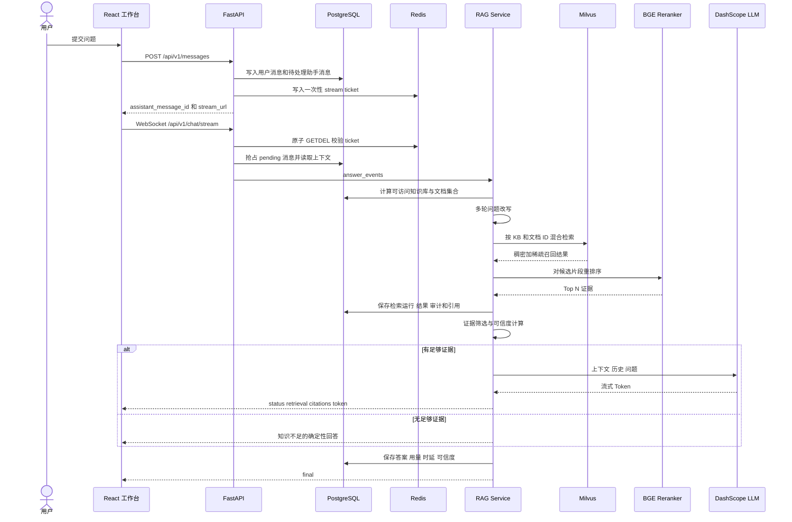
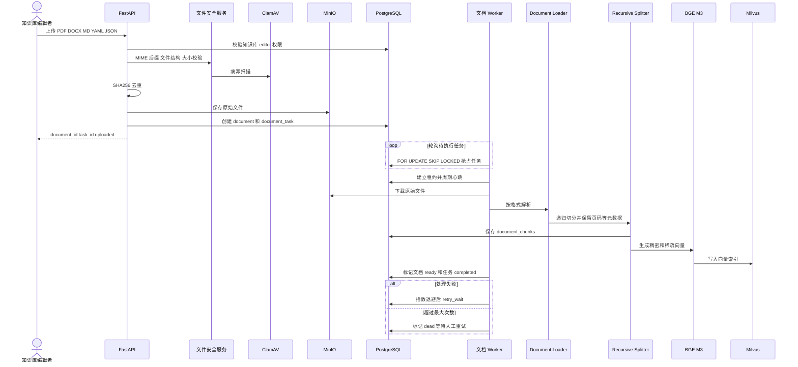
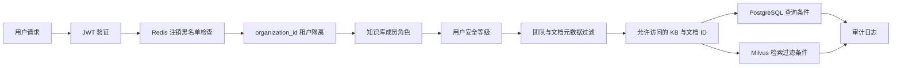

# DevMind-AI 功能架构与实现详图

> 本文以当前仓库代码为事实来源。系统形态是“React 前端 + FastAPI 模块化单体 + 独立文档 Worker”，问答生成目前在 WebSocket 请求进程内执行；文档任务由 PostgreSQL 任务表驱动，而不是 Redis Streams。

## 1. 系统总架构图

## 2. 功能架构图

```mermaid
flowchart TB
    system[DevMind AI 企业知识助手]

    system --> identity[身份与组织]
    identity --> passwordLogin[账号密码登录]
    identity --> smsLogin[短信验证码登录]
    identity --> token[JWT 签发 注销 黑名单]
    identity --> profile[个人资料与组织用户]

    system --> knowledge[知识资产管理]
    knowledge --> kbManage[知识库增删改查]
    knowledge --> member[成员角色管理]
    knowledge --> upload[文档上传 安检 去重]
    knowledge --> lifecycle[解析 切分 索引 重建 删除]
    knowledge --> faq[FAQ 列表与精确搜索]

    system --> qa[智能问答]
    qa --> session[会话与多轮上下文]
    qa --> permission[租户 知识库 文档权限过滤]
    qa --> retrieval[混合检索与重排序]
    qa --> generation[带引用的流式生成]
    qa --> trust[证据筛选 可信度 引用定位]

    system --> workspace[个人工作台]
    workspace --> history[历史会话]
    workspace --> favorite[消息收藏]
    workspace --> preference[用户偏好]
    workspace --> test[检索测试]

    system --> governance[安全与治理]
    governance --> rbac[知识库角色权限]
    governance --> fileGuard[文件结构校验与病毒扫描]
    governance --> audit[操作与检索审计]
    governance --> rateLimit[验证码与接口限流]
    governance --> metrics[健康检查 指标 请求追踪]
```

## 3. 智能问答主链路

实现要点：

- `POST /messages` 只创建消息与一次性流式票据；真正的检索和生成在随后建立的 WebSocket 连接内执行。
- `stream_ticket` 存在 Redis，TTL 为 300 秒，并通过 `GETDEL` 保证只能使用一次。
- 检索前先根据组织、知识库成员角色、用户团队和安全等级计算允许访问的知识库与文档 ID，再把 ID 过滤条件传给 Milvus。
- 检索结果、重排结果、引用、最终回答、Token 用量和各阶段耗时均落 PostgreSQL。
- 断流或生成异常会更新消息状态，客户端可通过消息接口重新读取结果或观察失败状态。

## 4. 文档入库与索引链路

可靠性设计：

- PostgreSQL 的 `document_tasks` 是当前实际任务队列。
- 多 Worker 通过 `FOR UPDATE SKIP LOCKED` 无冲突抢占任务。
- `worker_id`、`lease_expires_at` 和心跳用于识别失联 Worker；过期任务可被恢复。
- 失败任务进入 `retry_wait` 并退避重试，超过最大次数进入 `dead`，接口支持人工重试。
- PostgreSQL 保存可审计的 Chunk 正文与状态；Milvus 只保存可重建的向量索引；MinIO 保存原始文件。

## 5. 权限与安全链路

权限层次：组织租户是第一边界；知识库使用成员角色控制管理操作；检索时进一步按团队、安全等级和文档范围过滤。上传接口还执行白名单格式、声明 MIME、文件真实结构、大小、SHA256 重复检测及 ClamAV 扫描。

## 6. 数据职责

| 组件 | 当前职责 | 是否事实来源 |
| --- | --- | --- |
| PostgreSQL 16 | 用户、组织、权限、知识库、文档、任务、Chunk、会话、消息、引用、收藏、偏好、检索运行、审计 | 是 |
| Redis | 短信验证码、问题缓存、缓存锁、JWT 注销状态、一次性 WebSocket 票据 | 否，短期状态 |
| MinIO | 上传的原始文档对象；同时作为 Milvus 的对象存储依赖 | 原始文件来源 |
| Milvus | BGE-M3 稠密和稀疏向量、混合检索索引 | 否，可由 PostgreSQL Chunk 重建 |
| ClamAV | 上传文件病毒扫描 | 否 |
| DashScope | 问题改写或分类能力、最终回答生成 | 否 |

## 7. 功能到代码的映射

| 功能 | API 入口 | 核心实现 |
| --- | --- | --- |
| 服务启动、健康检查、指标 | `backend/app/main.py` | `backend/app/core/db.py`、`observability.py` |
| 路由聚合 | `backend/app/api/__init__.py` | 正式 API 前缀统一为 `/api/v1` |
| 登录、注册、短信、注销 | `backend/app/api/auth.py` | `services/user_service.py`、`core/security.py` |
| 用户资料、偏好、组织用户 | `backend/app/api/user.py` | `user_service.py`、`workspace_service.py` |
| 知识库、成员、文档接口 | `backend/app/api/knowledge.py` | `knowledge_base_service.py`、`document_service.py` |
| 文档后台任务 | `backend/app/worker.py` | `document_task_service.py`、`document_service.py` |
| 对象存储与文件安检 | 文档上传链路 | `object_storage_service.py`、`file_security_service.py` |
| 向量建立与混合检索 | 问答和文档链路 | `vector_index_service.py` |
| 会话、消息、WebSocket | `backend/app/api/chat.py` | `rag_service.py` |
| 改写、重排、可信度、Prompt | WebSocket 回答链路 | `internal_kb_qa/core/query_rewrite.py`、`reranker.py`、`confidence.py`、`prompts.py` |
| FAQ | `backend/app/api/faq.py` | `knowledge_service.py`、`postgres_qa/` |
| React 页面和 API 封装 | `front/src/App.jsx` | `front/src/api/qa.js` |
| 数据模型 | 无 | `sql/schema.sql`、`sql/migrations/` |

## 8. 当前实现与原设计文档的差异

1. 原设计图描述了“API 提交问答与文档任务到 Redis Streams，再由 RAG Worker 和文档 Worker 消费”。当前代码中，问答在 WebSocket 所在的 FastAPI 进程内执行，文档任务由 PostgreSQL `document_tasks` 表驱动。
2. 当前只有独立的文档 Worker 启动入口 `backend.app.worker`，没有独立的 RAG Worker 进程入口。
3. Redis 当前承担缓存、验证码、令牌状态和一次性流式票据，不承担文档任务队列。
4. `backend/app/api/workspace.py` 是旧的内存 Mock，未被正式 `api_router` 注册，不应纳入生产主链路。
5. Docker Compose 默认启动数据与安全依赖；后端服务定义仍是注释模板，实际 README 采用宿主机启动 FastAPI 和 Worker。

## 9. 架构判断与后续演进点

- 当前架构适合一期：模块化单体减少分布式复杂度，同时把耗时文档处理隔离为独立 Worker。
- 问答生成与 WebSocket 连接生命周期绑定。若并发增长或需要任务恢复，可把 RAG 执行迁移到可靠队列和独立 Worker，WebSocket 仅负责订阅事件。
- 文档队列表使用 PostgreSQL 已具备抢占、租约和重试能力；在吞吐量未形成瓶颈前，不必为了形式一致迁移 Redis Streams。
- Milvus 索引是派生数据，应持续保留从 PostgreSQL Chunk 全量重建和一致性校验能力。
- `Neo4j` 虽在 Compose 中存在，但未进入当前主链路；没有明确知识图谱需求前不应画入功能架构核心路径。
