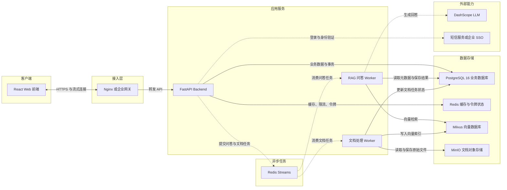

# DevMind AI 后端架构设计

## 已确认决策

1. 业务数据库采用 PostgreSQL 16。
2. 后端采用模块化单体，部署 API、RAG Worker、文档 Worker 三个进程。
3. 问答流式输出继续采用 WebSocket，并使用短期 `stream_ticket` 鉴权。

正式 API 地址为 `http://localhost:15200/api/v1`。`backend/app/api/workspace.py` 是前端联调用的内存 Mock，不注册到正式服务。

## 部署架构

## 代码分层

| 分层 | 职责 |
| --- | --- |
| `api` | HTTP/WebSocket、参数校验、鉴权和错误映射 |
| `application` | 登录、资料、问答、知识库和文档等业务用例 |
| `domain` | 租户权限、状态流转、可信度等纯业务规则 |
| `infrastructure` | PostgreSQL、Redis、Milvus、MinIO、LLM 和短信适配 |
| `workers` | RAG 与文档处理的异步任务消费 |

## 数据职责

- PostgreSQL 是用户、权限、知识库、文档状态、会话、消息、引用和审计的事实来源。
- Redis 保存验证码、限流、短期缓存、令牌撤销状态与异步任务。
- MinIO 保存原始文档。
- Milvus 保存可重建的 Chunk 向量索引。
- Neo4j 不进入一期主链路，出现明确的知识图谱检索需求后再启用。

## 实施阶段

1. 统一 `/api/v1`、15200、响应结构、请求 ID 和安全配置。
2. 完成用户资料、刷新令牌、租户和知识库权限持久化。
3. 完成知识库、文档上传、MinIO 和文档 Worker。
4. 完成会话、消息、RAG Worker、WebSocket 和引用落库。
5. 完成历史、收藏、设置、反馈、审计、测试和部署。
